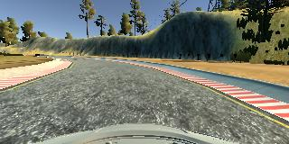
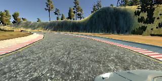
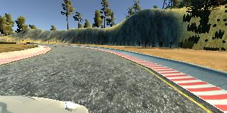

## Project Description

In this project, I use a neural network to clone car driving behavior.  It is a supervised regression problem between the car steering angles and the road images in front of a car.  

Those images were taken from three different camera angles (from the center, the left and the right of the car).  

The network is based on [The NVIDIA model](https://devblogs.nvidia.com/parallelforall/deep-learning-self-driving-cars/), which has been proven to work in this problem domain.

As image processing is involved, the model is using convolutional layers for automated feature engineering.  

### Files included

- model.py The script used to create and train the model.
- drive.py The script to drive the car. You can feel free to resubmit the original drive.py or make modifications and submit your modified version.
- utils.py The script to provide useful functionalities (i.e. image preprocessing and augumentation)
- model.h5 The model weights.

## Quick Start

Project Description
---
This repository contains starting files for the Behavioral Cloning Project.

In this project, I use a neural network to clone car driving behaviour. It is supervised regression problem between the car steering angle and the road image front the car.

Those images were taken from three different camera angles(from the center, left and right of the car).

The network is base on The NVIDIA model, which has been proven to work in this problem domain.

As image processing is involved, the model using convolution layers to automated feature engineering.


## Files include
* model.py: The script used to create and train model
* drive.py: The script to drive the car. 
* utils.py: The script to provide useful functionalities
* model.h5: The model weight
Creating a Great Writeup
---

### Run the pretrained model

Start up [the Udacity self-driving simulator](https://github.com/udacity/self-driving-car-sim), choose a scene and press the Autonomous Mode button.  Then, run the model as follows:

```python
python drive.py model.h5
```

### To train the model

You'll need the data folder which contains the training images.

```python
python model.py
```

This will generate a file `model-<epoch>.h5` whenever the performance in the epoch is better than the previous best.  For example, the first epoch will generate a file called `model-000.h5`.

## Model Architecture Design

The design of the network is based on [the NVIDIA model](https://devblogs.nvidia.com/parallelforall/deep-learning-self-driving-cars/), which has been used by NVIDIA for the end-to-end self driving test.  As such, it is well suited for the project.  

It is a deep convolution network which works well with supervised image classification / regression problems.  As the NVIDIA model is well documented, I was able to focus how to adjust the training images to produce the best result with some adjustments to the model to avoid overfitting and adding non-linearity to improve the prediction.

I've added the following adjustments to the model. 

- I used Lambda layer to normalized input images to avoid saturation and make gradients work better.
- I've added an additional dropout layer to avoid overfitting after the convolution layers.
- I've also included ELU for activation function for every layer except for the output layer to introduce non-linearity.

In the end, the model looks like as follows:

- Image normalization
- Convolution: 5x5, filter: 24, strides: 2x2, activation: ELU
- Convolution: 5x5, filter: 36, strides: 2x2, activation: ELU
- Convolution: 5x5, filter: 48, strides: 2x2, activation: ELU
- Convolution: 3x3, filter: 64, strides: 1x1, activation: ELU
- Convolution: 3x3, filter: 64, strides: 1x1, activation: ELU
- Drop out (0.5)
- Fully connected: neurons: 100, activation: ELU
- Fully connected: neurons:  50, activation: ELU
- Fully connected: neurons:  10, activation: ELU
- Fully connected: neurons:   1 (output)

## Data Preprocessing

### Image Sizing

- the images are cropped so that the model won’t be trained with the sky and the car front parts
- the images are resized to 70x160 (3 RGB channels) as per NVIDIA model
- the images are normalized (image data divided by 127.5 and subtracted 1.0).  As stated in the Model Architecture section, this is to avoid saturation and make gradients work better)


## Model Training

### Image Augumentation

For training, I used the following augumentation technique along with Python generator to generate unlimited number of images:

- Randomly choose right, left or center images.
- For left image, steering angle is adjusted by +0.2
- For right image, steering angle is adjusted by -0.2
- Randomly flip image left/right
- Randomly translate image horizontally with steering angle adjustment (0.002 per pixel shift)
- Randomly translate image virtically
- Randomly added shadows
- Randomly altering image brightness (lighter or darker)

Using the left/right images is useful to train the recovery driving scenario.  The horizontal translation is useful for difficult curve handling (i.e. the one after the bridge).


### Examples of Augmented Images

The following is the example transformations:

**Center Image**



**Left Image**



**Right Image**



## Training, Validation and Test

I splitted the images into train and validation set in order to measure the performance at every epoch.  Testing was done using the simulator.

As for training, 

- I used mean squared error for the loss function to measure how close the model predicts to the given steering angle for each image.
- I used Adam optimizer for optimization with learning rate of 1.0e-4 which is smaller than the default of 1.0e-3.  The default value was too big and made the validation loss stop improving too soon.
- I used ModelCheckpoint from Keras to save the model only if the validation loss is improved which is checked for every epoch.

### The Lake Side Track

As there can be unlimited number of images augmented, I set the samples per epoch to 20,000.  I tried from 1 to 200 epochs but I found 5-10 epochs is good enough to produce a well trained model for the lake side track.  The batch size of 40 was chosen as that is the maximum size which does not cause out of memory error on my Mac with NVIDIA GeForce GT 650M 1024 MB.

### Dependencies
This lab requires:

* [CarND Term1 Starter Kit](https://github.com/udacity/CarND-Term1-Starter-Kit)

The lab enviroment can be created with CarND Term1 Starter Kit. Click [here](https://github.com/udacity/CarND-Term1-Starter-Kit/blob/master/README.md) for the details.

The following resources can be found in this github repository:
* drive.py
* video.py
* writeup_template.md

The simulator can be downloaded from the classroom. In the classroom, we have also provided sample data that you can optionally use to help train your model.

## Details About Files In This Directory

### `drive.py`

Usage of `drive.py` requires you have saved the trained model as an h5 file, i.e. `model.h5`. See the [Keras documentation](https://keras.io/getting-started/faq/#how-can-i-save-a-keras-model) for how to create this file using the following command:
```sh
model.save(filepath)
```

Once the model has been saved, it can be used with drive.py using this command:

```sh
python drive.py model.h5
```

The above command will load the trained model and use the model to make predictions on individual images in real-time and send the predicted angle back to the server via a websocket connection.

Note: There is known local system's setting issue with replacing "," with "." when using drive.py. When this happens it can make predicted steering values clipped to max/min values. If this occurs, a known fix for this is to add "export LANG=en_US.utf8" to the bashrc file.

#### Saving a video of the autonomous agent

```sh
python drive.py model.h5 run1
```

The fourth argument, `run1`, is the directory in which to save the images seen by the agent. If the directory already exists, it'll be overwritten.

```sh
ls run1

2018_07_19_20_34_35_114.jpg  2018_07_19_20_36_17_723.jpg
2018_07_19_20_34_35_132.jpg  2018_07_19_20_36_17_803.jpg
2018_07_19_20_34_35_198.jpg  2018_07_19_20_36_17_819.jpg
2018_07_19_20_34_35_216.jpg  2018_07_19_20_36_17_836.jpg
2018_07_19_20_34_35_234.jpg  2018_07_19_20_36_17_913.jpg
2018_07_19_20_34_35_301.jpg  2018_07_19_20_36_17_930.jpg
2018_07_19_20_34_35_320.jpg  2018_07_19_20_36_17_948.jpg
2018_07_19_20_34_35_338.jpg  2018_07_19_20_36_18_024.jpg
2018_07_19_20_34_35_402.jpg  2018_07_19_20_36_18_041.jpg
2018_07_19_20_34_35_421.jpg  2018_07_19_20_36_18_059.jpg
2018_07_19_20_34_35_439.jpg  2018_07_19_20_36_18_136.jpg
2018_07_19_20_34_35_500.jpg  2018_07_19_20_36_18_153.jpg
2018_07_19_20_34_35_518.jpg  2018_07_19_20_36_18_170.jpg
...
```

The image file name is a timestamp of when the image was seen. This information is used by `video.py` to create a chronological video of the agent driving.

### `video.py`

```sh
python video.py run1
```

Creates a video based on images found in the `run1` directory. The name of the video will be the name of the directory followed by `'.mp4'`, so, in this case the video will be `run1.mp4`.

Optionally, one can specify the FPS (frames per second) of the video:

```sh
python video.py run1 --fps 48
```

Will run the video at 48 FPS. The default FPS is 60.


